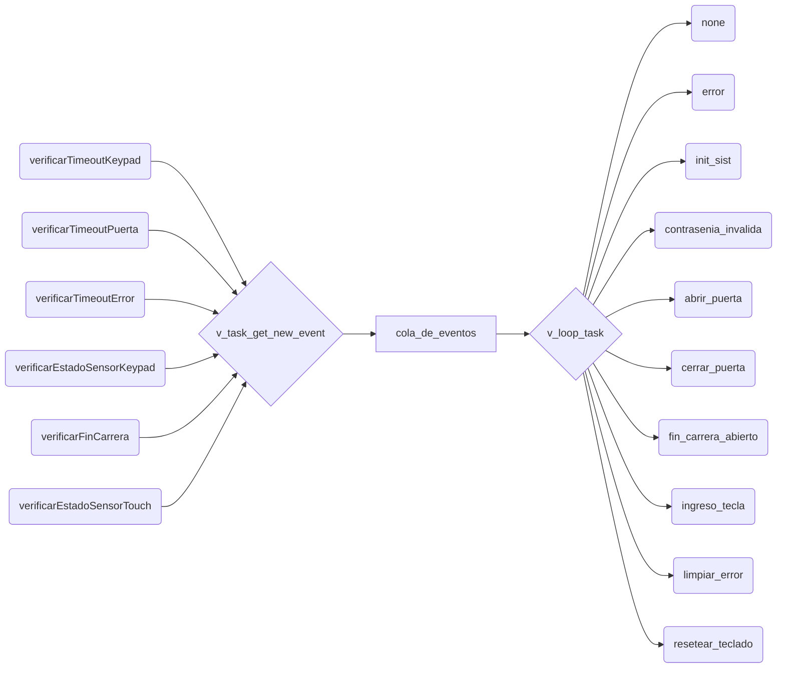

# Documentación técnica

## 1. Propósito del sistema

El firmware controla una puerta motorizada de acceso a un gimnasio sobre una **ESP32 DevKit V1**. El acceso se habilita ingresando un DNI por teclado matricial; al validarse, un puente H (DRV8833) mueve un motor DC de 6V hasta un final de carrera, se mantiene un tiempo abierta, y luego se cierra sola. También hay un sensor táctil capacitivo como método alternativo de apertura, un display LCD I2C para feedback visual, un buzzer para feedback sonoro, y una base para publicar por MQTT la ocupación del gimnasio (aún no activa).

El diseño central es una **máquina de estados finitos (FSM) por tabla**, corriendo sobre dos tareas de FreeRTOS que se comunican por una cola de eventos.

---

## 2. Arquitectura general



- **`v_task_get_new_event`**: cada ~5ms consulta, de a uno por vuelta (round-robin), uno de los 6 "verificadores de sensores" y encola el evento resultante en `queueEvents`. 
- **`v_loop_task`**: consume la cola en un loop infinito y, para cada evento recibido, ejecuta la función de transición que corresponde según el estado actual (`state_table[estado][evento]`). Ejecuta la **FSM**

Separar "detectar eventos" de "reaccionar a eventos" en dos tareas permite que la lectura de sensores (teclado, finales de carrera, touch, timeouts) nunca se vea bloqueada por lo que tarde una transición (por ejemplo, escribir en el LCD).

---

## 3. Mapeo de hardware (pines)

| Periférico | Pin(es) | Notas |
|---|---|---|
| Buzzer | GPIO 13 | `tone()` para beeps de error y cuenta regresiva |
| Final de carrera "abierta" | GPIO 25 (`GREEN_PULSADOR`) | `INPUT_PULLUP`, activo en `LOW` |
| Final de carrera "cerrada" | GPIO 26 (`RED_PULSADOR`) | `INPUT_PULLUP`, activo en `LOW` |
| LED rojo | GPIO 32 | Indica error / DNI incorrecto |
| LED verde | GPIO 33 | Indica puerta abriéndose |
| Display LCD I2C | SDA=21, SCL=22, addr 0x27 | 16x2, librería `LiquidCrystal_I2C` |
| Teclado matricial 4x3 | Filas: 23,19,18,17 — Columnas: 16,4,27 | Librería `Keypad` |
| Puente H DRV8833 | IN1 = GPIO 12, IN2 = GPIO 14 | PWM con `analogWrite`, velocidad fija 127/255 |
| Sensor touch capacitivo | GPIO 15 | `touchRead()`, umbral 1000 |

---

## 4. Constantes clave

| Constante | Valor | Significado |
|---|---|---|
| `TAM_DNI` | 8 | Longitud máxima del buffer de DNI ingresado por teclado |
| `PASS_TEST` | `"1234567"` | Clave válida hardcodeada (placeholder de prueba) |
| `TIEMPO_PUERTA_ABIERTA` | 10000 ms | Cuánto queda abierta la puerta antes de cerrar sola |
| `TIEMPO_ERROR` | 3000 ms | Cuánto se muestra un mensaje temporal en el LCD (error / puerta cerrada) |
| `TIMEOUT_INGRESO` | 5000 ms | Inactividad de teclado antes de cancelar el ingreso en curso |
| `VELOCIDAD_MOTOR` | 127 | Duty cycle del PWM al motor (de 0 a 255) |
| `UMBRAL_TOUCH` | 1000 | Por debajo de esta lectura, se considera "tocado" |
| `SIZE_QUEUE_TIMER` | 30 | Capacidad de la cola de eventos entre tareas |
| `MAX_TIPO_EVENTOS` | 6 | Cantidad de "verificadores de sensores" en el round-robin |

---

## 5. La máquina de estados

### 5.1 Estados

```cpp
enum states { ST_ARRANQUE, ST_PUERTA_CERRADA, ST_ABRIENDO_PUERTA, ST_PUERTA_ABIERTA, ST_CERRANDO_PUERTA };
```

- **`ST_ARRANQUE`**: estado inicial, solo dura hasta que corre `init_sist()` una vez.
- **`ST_PUERTA_CERRADA`**: estado de reposo. Acepta ingreso por teclado y toque capacitivo.
- **`ST_ABRIENDO_PUERTA`**: motor girando en sentido de apertura, esperando el final de carrera.
- **`ST_PUERTA_ABIERTA`**: puerta abierta, corre la cuenta regresiva en el LCD.
- **`ST_CERRANDO_PUERTA`**: motor girando en sentido de cierre, esperando el otro final de carrera.

### 5.2 Eventos

```cpp
enum events {
  EV_CONT, EV_CONTRASENIA_INVALIDA, EV_CONTRASENIA_VALIDA, EV_TOUCH_DETECTADO,
  EV_FIN_CARRERA_ABIERTO, EV_FIN_CARRERA_CERRADO, EV_INGRESO_TECLA,
  EV_TIMEOUT_PUERTA, EV_TIMEOUT_ERROR, EV_TIMEOUT_TECLADO, EV_CANCELAR_TECLADO, EV_UNKNOW
};
```

`EV_CONT` es un "no-evento": significa "este verificador no detectó nada nuevo esta vuelta". Es el valor que más circula por la cola (la mayoría de los ciclos de polling no detectan cambios).

### 5.3 Tabla de transición

`state_table[estado][evento]` es un arreglo de punteros a función: `transition state_table[MAX_STATES][MAX_EVENTS]`. Cada celda es la función que se ejecuta cuando, estando en ese estado, llega ese evento. Esto evita un enjambre de `if/switch` anidados: agregar un estado o evento nuevo es agregar una fila/columna a la tabla.

Resumen de las transiciones activas (`error` = combinación imposible/ignorada, `none` = no hace nada):

| Estado \ Evento | Contraseña inválida | Contraseña válida | Touch | Fin carrera abierto | Fin carrera cerrado | Tecla | Timeout puerta | Timeout error | Timeout teclado | Cancelar |
|---|---|---|---|---|---|---|---|---|---|---|
| **PUERTA_CERRADA** | `contrasenia_invalida` | `abrir_puerta` | `abrir_puerta` | — | — | `ingreso_tecla` | — | `limpiar_error` | `resetear_teclado` | `resetear_teclado` |
| **ABRIENDO_PUERTA** | — | — | — | `fin_carrera_abierto` | — | — | — | — | — | — |
| **PUERTA_ABIERTA** | — | — | `cerrar_puerta` | — | — | — | `cerrar_puerta` | — | — | — |
| **CERRANDO_PUERTA** | — | — | — | — | `fin_carrera_cerrado` | — | — | — | — | — |

Además, cada estado tiene su función para `EV_CONT`: `none()` en la mayoría, y `mostrar_timer()` en `PUERTA_ABIERTA` (para refrescar la cuenta regresiva en cada ciclo mientras no pasa nada más).

---

## 6. Los "verificadores de sensores" (productor de eventos)

Son 6 funciones, todas con la firma `events verificarX()`, agrupadas en un arreglo de punteros a función (`verificar_sensor[MAX_TIPO_EVENTOS]`) para poder recorrerlas en round-robin:

| Índice | Función | Qué chequea |
|---|---|---|
| 0 | `verificarTimeoutKeypad` | Si venció el timeout de inactividad del teclado (vía semáforo, ver §8) |
| 1 | `verificarTimeoutPuerta` | Si pasaron `TIEMPO_PUERTA_ABIERTA` ms desde que se abrió la puerta |
| 2 | `verificarTimeoutError` | Si pasaron `TIEMPO_ERROR` ms desde que se mostró un mensaje temporal |
| 3 | `verificarEstadoSensorTouch` | Flanco de "tocado" en el sensor capacitivo |
| 4 | `verificarEstadoSensorKeypad` | Si hay una tecla nueva presionada, y qué significa (`#` valida, `*` cancela, dígito = ingreso) |
| 5 | `verificarFinCarrera` | Flancos en los dos finales de carrera (pulsadores) |

`v_task_get_new_event` llama a uno por vuelta, en orden circular, con un `vTaskDelay(5ms)` entre vueltas — por lo tanto cada verificador individual se revisa aproximadamente cada 6 × 5ms = 30ms.

---

## 7. Las transiciones (consumidor de eventos)

Cada función de transición corre siempre dentro de `v_loop_task`, nunca concurrentemente entre sí (una sola tarea las ejecuta, una por vez, sacándolas de la cola).

| Función | Qué hace |
|---|---|
| `init_sist()` | Inicializa periféricos (I2C, pines, LCD, motor detenido, LEDs apagados), crea el timer de inactividad de teclado, pasa a `ST_PUERTA_CERRADA` |
| `none()` / `error()` | No-ops (el segundo documenta explícitamente una combinación estado/evento que no debería ocurrir) |
| `contrasenia_invalida()` | Detiene el timer de teclado, muestra "DNI Incorrecto", enciende LED rojo, beep de error, arranca el timer de mensaje temporal, limpia el buffer de teclado |
| `limpiar_error()` | Apaga LED rojo, vuelve a la pantalla de reposo |
| `ingreso_tecla()` | Agrega el último dígito al buffer de DNI, lo muestra en el LCD, reinicia el timer de inactividad de teclado |
| `resetear_teclado()` | Cancela el timer de teclado, limpia el buffer, vuelve a pantalla de reposo (por `*` o por timeout) |
| `abrir_puerta()` | Detiene timer de teclado, enciende LED verde, arranca el motor en sentido de apertura, pasa a `ST_ABRIENDO_PUERTA` |
| `fin_carrera_abierto()` | Detiene el motor, apaga LED verde, arma el timer de "puerta abierta" (`lct = millis()`), muestra cuenta regresiva, pasa a `ST_PUERTA_ABIERTA` |
| `mostrar_timer()` | Recalcula el tiempo restante y actualiza el LCD solo cuando cambia el segundo mostrado; hace beep en los últimos 5 segundos |
| `cerrar_puerta()` | Arranca el motor en sentido de cierre, pasa a `ST_CERRANDO_PUERTA` |
| `fin_carrera_cerrado()` | Detiene el motor, muestra "Puerta Cerrada", arma el timer de mensaje temporal, vuelve a `ST_PUERTA_CERRADA` |

---

## 8. Sincronización entre tareas

Esta FSM tiene dos tareas de FreeRTOS que corren de forma concurrente y comparten variables. Sin protección, esto genera **condiciones de carrera**: una tarea puede leer una variable justo mientras la otra la está escribiendo, obteniendo un valor inconsistente. Se usan dos mecanismos, cada uno para un problema distinto:

### 8.1 `mutexTimersCompartidos` (mutex) — protege datos compartidos

Protege el "paquete" `lct` / `timer_puerta_activo` / `error_timer` / `mostrando_error`: `v_loop_task` las **escribe** (en `contrasenia_invalida`, `limpiar_error`, `abrir_puerta`, `fin_carrera_abierto`, `cerrar_puerta`, `fin_carrera_cerrado`) y `v_task_get_new_event` las **lee** (en `verificarTimeoutPuerta` y `verificarTimeoutError`). Un mutex es la herramienta correcta para exclusión mutua: quien lo toma es quien lo suelta, y FreeRTOS le da herencia de prioridad para evitar inversión de prioridad.

```cpp
xSemaphoreTake(mutexTimersCompartidos, portMAX_DELAY);
// leer o escribir las variables protegidas
xSemaphoreGive(mutexTimersCompartidos);
```

### 8.2 `semTimeoutTeclado` (semáforo binario) — señaliza un evento puntual

Reemplaza al antiguo flag `flag_timeout_teclado`. El timer de inactividad de teclado dispara su callback en la tarea *Timer Service* de FreeRTOS (una tercera tarea, distinta de las dos anteriores), que necesita **avisarle** a `v_task_get_new_event` que ocurrió el timeout. Acá no hay un dato que proteger, hay un evento que señalizar de una tarea a otra — para eso es un semáforo binario, no un mutex (no tiene noción de "dueño": quien lo da no es quien lo toma).

```cpp
// en el callback del timer:
xSemaphoreGive(semTimeoutTeclado);

// en verificarTimeoutKeypad(), toma no bloqueante:
if (xSemaphoreTake(semTimeoutTeclado, 0) == pdTRUE) { /* hubo timeout */ }
```

`detener_timer_teclado()` además vacía el semáforo (`xSemaphoreTake(semTimeoutTeclado, 0)`) para descartar un timeout que haya quedado pendiente sin consumir, equivalente a lo que antes hacía `flag_timeout_teclado = false`.

### 8.3 La cola de eventos (`queueEvents`)

No es solo un canal de datos: también es el mecanismo de sincronización principal entre ambas tareas. `xQueueSend`/`xQueueReceive` usan un timeout finito (`pdMS_TO_TICKS(200)` al enviar, en vez de `portMAX_DELAY`) para que, si `v_loop_task` alguna vez dejara de consumir por cualquier motivo, `v_task_get_new_event` no quede bloqueada para siempre — y para poder loguear el problema (`"Get_event TIMEOUT: Queue is full."`) en vez de trabarse en silencio.

---

## 9. Bugs reales detectados y corregidos durante el desarrollo

Documentado acá porque son parte del historial del diseño y ayudan a entender por qué el código luce como luce:

1. **Condición de carrera en `lct`/`error_timer`** — escritas por `v_loop_task`, leídas sin protección por `v_task_get_new_event`. Corregido con `mutexTimersCompartidos` (§8.1).
2. **Condición de carrera en `flag_timeout_teclado`** — modificada por el callback del timer (tarea *Timer Service*), leída sin protección desde `v_task_get_new_event`. Corregido reemplazando el flag por `semTimeoutTeclado` (§8.2).
3. **Overflow de `ult_indice_tipo_sensor`**: al ser un `short` que crecía sin límite, desbordaba a negativo tras ~165 segundos de uptime, causando que `verificar_sensor[indice]` accediera fuera de los límites del arreglo (comportamiento indefinido: dejaba de detectar eventos reales, y el sistema quedaba "trabado" en el estado en que estuviera hasta que, tras otro intervalo similar, el índice volvía a caer dentro de rango). 
4. **Riesgo de cuelgue indefinido del bus I2C**: se agregó `Wire.setTimeOut(50)` para que una comunicación I2C fallida (LCD) no bloquee indefinidamente a `v_loop_task`.

---

## 10. Limitaciones conocidas / pendientes

- `PASS_TEST` es una clave fija hardcodeada; no hay gestión de múltiples DNIs válidos.
- El bloque de MQTT (`actualizarYPublicarOcupacion`) está comentado y no conectado a la FSM: no hay conteo real de ocupación ni conexión WiFi activa todavía.
- No hay manejo de reconexión ni de fallos del teclado o de los finales de carrera (por ejemplo, si nunca llega el final de carrera, el estado `ST_ABRIENDO_PUERTA`/`ST_CERRANDO_PUERTA` queda esperando indefinidamente — es un comportamiento esperado del diseño actual, no un bug, pero conviene tenerlo presente).
- No hay watchdog de tareas (`esp_task_wdt`) configurado como red de seguridad ante un cuelgue no previsto.